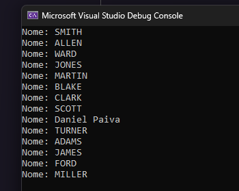

<h1 align="center"> Example of connecting to the MySql database using C# 😄</h1>

    

 <a href="#status">Status</a> • 
 <a href="#objective">Objective</a> •
 <a href="#installation">Installation</a> • 
 <a href="#technology">Technology</a> • 
 <a href="#author">Author</a> • 
 <a href="#licence">License</a>

<h2 align="center" id=status> 
	⌛ Concluded ⌛
</h2>

<h2 id=objective>📜 About</h2>
Example of connecting to the MySql database using C#. 
SDK used .Net 6.

Nuget API
~~~
https://api.nuget.org/v3/index.json
~~~

Connection example for MySql:
~~~
string connectionString = "server=localhost;port=3306;database=SEU_BANCO;uid=SEU_USER;password=SUA_SENHA";
~~~

<h2 id=installation>✔️ Installation</h2>

1. Clone the repo.
2. Exec script sql
3. Debug project

<h2 id=technology>🧰 Technology</h2>

The following tools were used in the construction of the project:

- IDE: <a href="https://code.visualstudio.com/download">Visual Studio Code</a>
- MySql: <a href="https://www.mysql.com/">MySQL Workbench</a>

<h2 id=author>😎 Author</h2>

Developed by <a href="https://www.linkedin.com/in/danhpaiva/" target="_blank">Daniel Paiva</a>

<h2 id=licence>🆓 Licence</h2>
View the license for this project 
<a href="https://github.com/danhpaiva/example-csharp-database-202302-01/blob/main/LICENSE" target="_blank">MIT</a>
